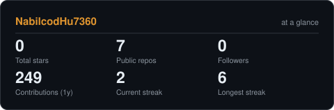
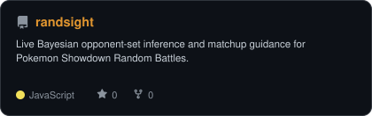
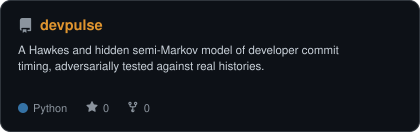
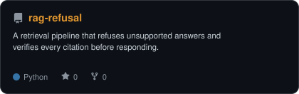
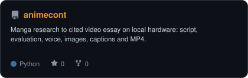

⚛️ I'm currently working with **Dr. Nazarenko** on **LAMMPS simulations of dendrimers** for capacitor and energy-storage applications.

🥽 I'm researching **VR systems, immersive data environments, and responsible AI** at the VR Lab.

🎓 I'm studying **Computer Science and Polymer Science & Engineering** at the University of Southern Mississippi.

🔬 Previously, I contributed to **AFM image-analysis research**.

### Where to find me

---

## About me

I'm **Nabil**, a Computer Science and Polymer Science & Engineering student at the University of Southern Mississippi, maintaining a **4.0 GPA** while working across scientific imaging, immersive systems, and grounded AI. I build research software around a recurring question: **how do you know the thing you just measured is real?**

- Working with **Dr. Nazarenko** on LAMMPS simulations of dendrimers for capacitor and energy-storage applications
- **Undergraduate Researcher, VR Lab:** developing full-stack systems for immersive data environments and co-authoring work on the ethical, social, and technical dimensions of AI
- Presented original research on **AI mimicry and persuasion** at the 2026 MAS Conference
- Interested in research collaborations, internships, and graduate study at the intersection of polymer science and computation

## Current toolkit

---

## Activity

<picture>
  <source media="(prefers-color-scheme: dark)" srcset="assets/card-stats-dark.svg">
  <source media="(prefers-color-scheme: light)" srcset="assets/card-stats-light.svg">
  
</picture>

  

<picture>
  <source media="(prefers-color-scheme: dark)" srcset="assets/radar-langs-dark.svg">
  <source media="(prefers-color-scheme: light)" srcset="assets/radar-langs-light.svg">
  
</picture>

 

Project cards and charts refresh daily from the GitHub API. The native contribution calendar appears below this README.

---

## Selected work

<table>
<tr>
<td width="50%"><a href="https://github.com/NabilcodHu7360/randsight"><picture><source media="(prefers-color-scheme: dark)" srcset="assets/card-randsight-dark.svg"><source media="(prefers-color-scheme: light)" srcset="assets/card-randsight-light.svg"></picture></a></td>
<td width="50%"><a href="https://github.com/NabilcodHu7360/devpulse"><picture><source media="(prefers-color-scheme: dark)" srcset="assets/card-devpulse-dark.svg"><source media="(prefers-color-scheme: light)" srcset="assets/card-devpulse-light.svg"></picture></a></td>
</tr>
<tr>
<td width="50%"><a href="https://github.com/NabilcodHu7360/rag-refusal"><picture><source media="(prefers-color-scheme: dark)" srcset="assets/card-rag-refusal-dark.svg"><source media="(prefers-color-scheme: light)" srcset="assets/card-rag-refusal-light.svg"></picture></a></td>
<td width="50%"><a href="https://github.com/NabilcodHu7360/animecont"><picture><source media="(prefers-color-scheme: dark)" srcset="assets/card-animecont-dark.svg"><source media="(prefers-color-scheme: light)" srcset="assets/card-animecont-light.svg"></picture></a></td>
</tr>
</table>

| Project | What it is | Stack |
|---|---|---|
| **[randsight](https://github.com/NabilcodHu7360/randsight)** | Live Bayesian opponent-set inference and matchup guidance for Pokemon Showdown Random Battles | `JavaScript` `Chrome Extension` `Bayesian inference` |
| **[devpulse](https://github.com/NabilcodHu7360/devpulse)** | Hawkes + HSMM modeling of developer commit timing, tested against an adversarial real-vs-simulated classifier | `Python` `NumPy` `scikit-learn` |
| **[rag-refusal](https://github.com/NabilcodHu7360/rag-refusal)** | A retrieval pipeline that refuses unsupported answers and verifies citations before responding | `Python` `RAG` `evaluation` |
| **[animecont](https://github.com/NabilcodHu7360/animecont)** | A local pipeline from manga research to cited script, narration, images, captions, and video | `Python` `TTS` `Stable Diffusion` `FFmpeg` |

---

The core charts and project cards are generated into this repository and refreshed by GitHub Actions.

